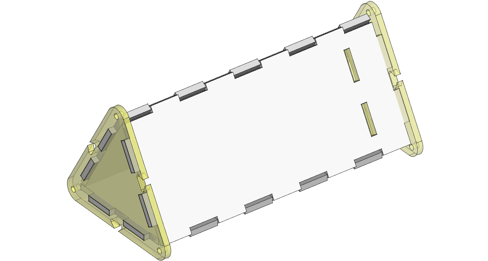
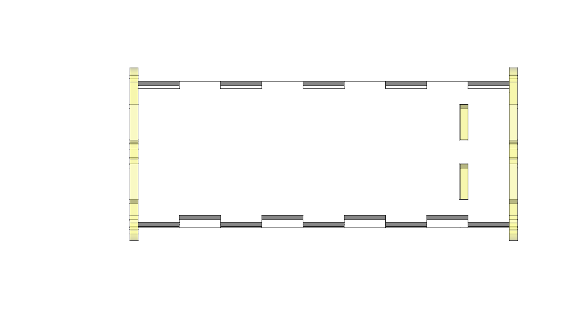
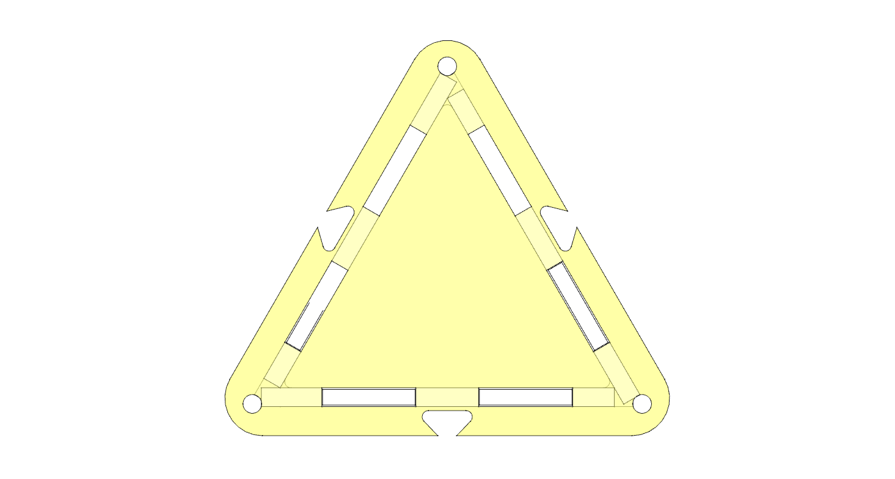
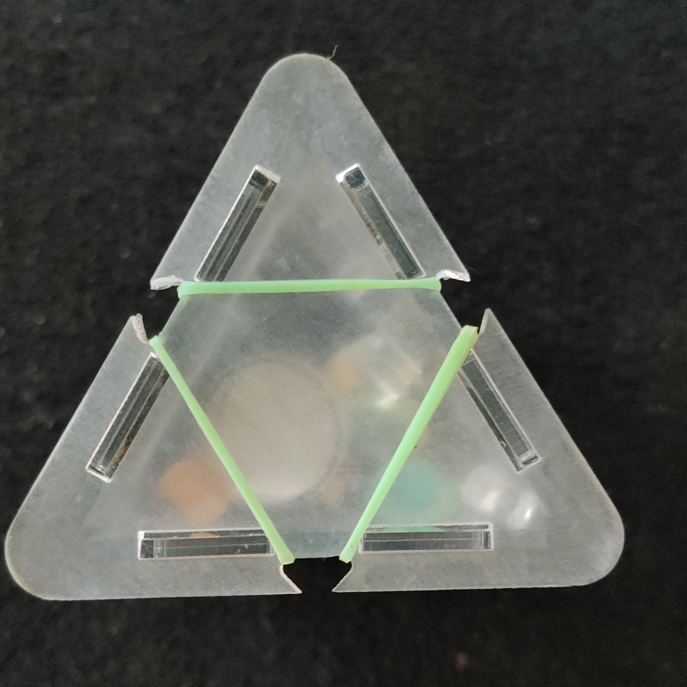
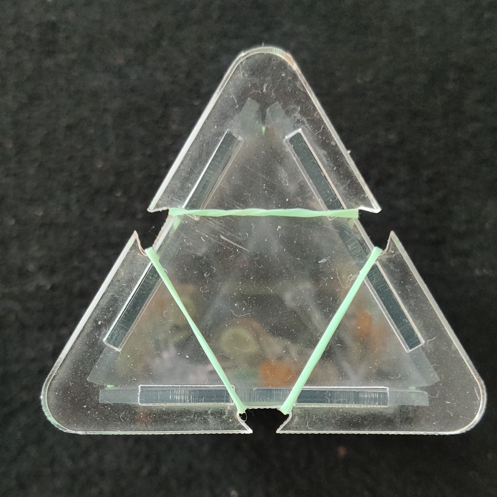
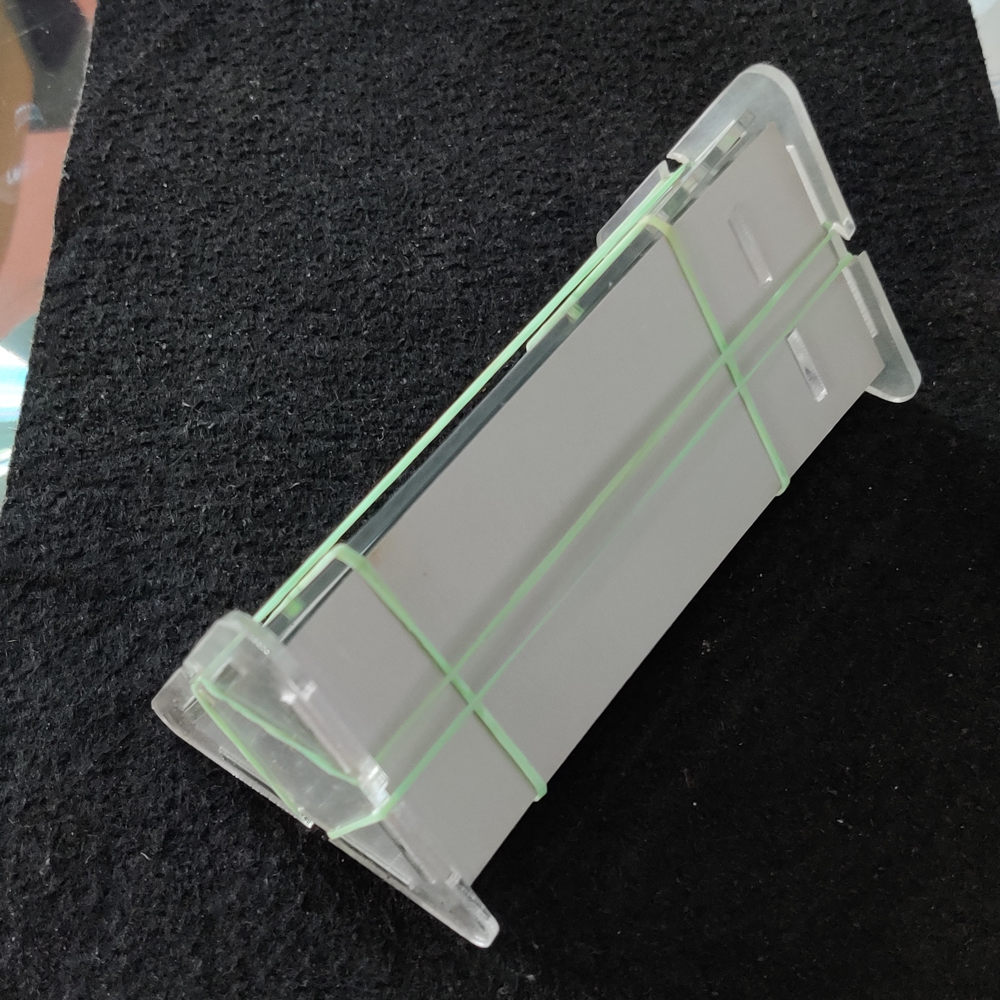

* Kaleidoscope *

- A simple Kaleidoscope design for DiY hour.
- Laser cut parts, including the mirrors (acrylic).
- Requires just a few elastic bands to assemble and put it all together.
- The end-piece transparent acrylic may need to be sand-papered to make it transluscent (instead of transparent).
- The eye-piece is transparent acrylic.
- The other three side pieces are mirror acrylic.

